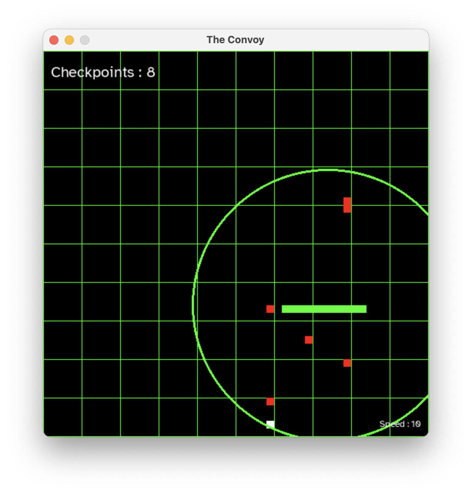

# The Convoy

  You are the convoy commodore of the Convoy, who is tasked with escorting merchant ships. Your mission is simple yet challenging: reach as many checkpoints as possible and evade U-boats, which will inflict damage on the convoy. Godspeed.

## Instructions

### Controls

| Keys | Role        |
|------|-------------|
| a / left arrow    | Move Left   |
| d / right arrow    | Move Right  |
| w / up arrow   | Move Up  |
| s / down arrow   |  Move Down |
| escape    |  Quit game  |

### Mechanics

| Colour | Name        |
|------|-------------|
| 🟩 Green    | The Convoy   |
| ⬜️ White    | Checkpoint  |
| 🟥 Red   | U-boat  |

[U-boats](https://en.wikipedia.org/wiki/U-boat) will sink the Convoy in one hit; while checkpoints will increase its size by 1. U-boats appear and disappear from the map every 3 seconds, they will still cause damage when invisible. 

### Settings

Throttle the speed by pressing the comma (",") key for decreasing and the period/fullstop (".") key for increasing. The speed increases/decreases in increments of 10.

Teleportation is disabled by default but can be enabled by uncommenting code in the file.

### Read the extended version of the instructions [here](https://github.com/Darr3n2GG/The-Convoy/wiki/Instructions).

## Installation

To play The Convoy, Python and Pygame are required.

1. Install Python (if required): [python.org](https://www.python.org/). 

2. Install Pygame (if required): [pygame.org](https://www.pygame.org/wiki/GettingStarted). 

3. Download The Convoy [here](https://github.com/Darr3n2GG/The-Convoy/releases/tag/v1.1). 

4. Open The Convoy in a code editor (recommended), or with any other workable method of your choice.

5. Run The Convoy in your code editor (recommended), or run it in your command-line interface.

6. The Convoy will open in a new window.

If help is needed, feel free to ask at [Discussions/Installation and Game Help](https://github.com/Darr3n2GG/The-Convoy/discussions/categories/installation-and-game-help).

 
## Credits
 
  Derived from [Rajat Dipta Biswas's Snake Eater](https://github.com/rajatdiptabiswas/snake-pygame).
  
  Sounds from Pixabay. ( [Sonar](https://pixabay.com/sound-effects/sonar-a-dry-98689/) [Explode](https://pixabay.com/sound-effects/large-underwater-explosion-190270/) )
  
  Sounds from creatorassets. [Repair (reach_checkpoint)](https://creatorassets.com/a/8-bit-coin-sound-effects)
